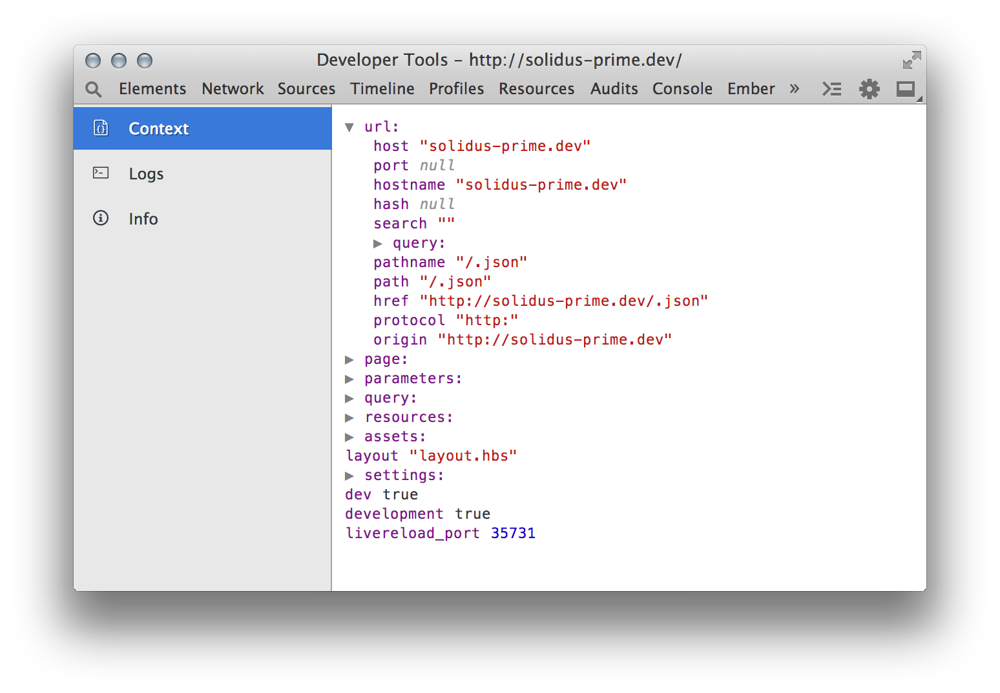

A Google Chrome developer tools extension for use by [Solidus](https://github.com/solidusjs/solidus) developers. Provides real-time introspection of API data and access to Solidus server error logs for use in debugging preprocessors executed in the Node.js runtime environment.

#Clone
* Clone the repo with `git clone https://github.com/solidusjs/devtools-solidus.git devtools-solidus`

#Installation
* Download the `.crx` file from the latest release, or you can manually build your own (see below).
* Open [chrome://extensions](chrome://extensions) in Chrome.
* Drag and drop the `.crx` file onto the page and click "Add" to install.

#Manually Build
* Run `npm install` to install dependencies (npm will automatically run a script to install front-end dependencies using bower).
* Run `grunt build` to generate an installable `.crx` file in the `dist/` directory.

#Usage
* The extension currently requires a pre-release version of Solidus. To use this version, update `package.json` to point to `"git+https://github.com/solidusjs/solidus.git#2b830f4c08"`. A `log_server_port` port must also be specified in order for log streaming to work. Note that this feature won't work currently with the [vagrant-solidus plugin](https://github.com/solidusjs/vagrant-solidus).

* Once the extension is installed, you can open Chrome's Developer Tools and you should see a "Solidus" tab.
